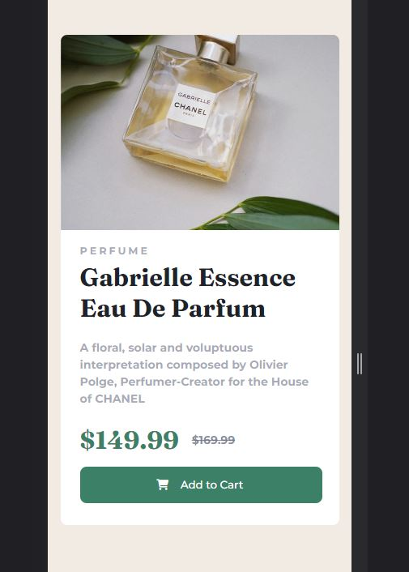

- [Overview](#overview)
  - [The challenge](#the-challenge)

    Responsive design, design for mobile first.
  - [Screenshot](#screenshot)

  
  
  - [Links](#links)

- [My process](#my-process)
  - [Built with](#built-with)

    VSCode
    Built the HTML elements in correct order, noticing the text and pricing will need different formatting. Also noted a FA for shopping cart

    Applied CSS, used a  to compensate for the FAicon displacing the button text

    Then built the website version, nesting the content into a new div for responsiveness. 

    Note: I built this using F12 Developer Tools on Chrome to specify exact dimensions. With it closed, the website appears far too zoomed in. Oops!

  - [What I learned](#what-i-learned)

  Initially tried to position the img and textArea seperately, looked fine until you changed window sizes slightly. Was entirely dependent on being 1440px large. Putting them all into a single div and scaling that made it far easier and responsive. Didn't do that with the mobile version, should try that next time at the start.

  - [Continued development](#continued-development)
  - [Useful resources](#useful-resources)
- [Author](#author)

  Michael D

- [Acknowledgments](#acknowledgments)